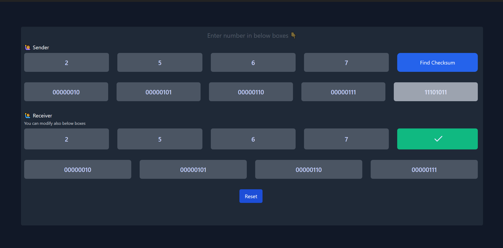
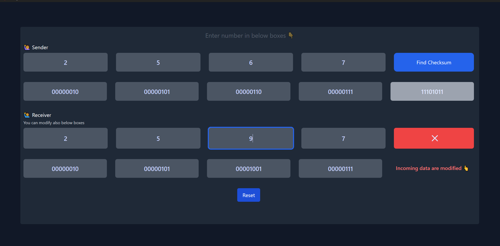

# Checksum Demo

It is an interactive react app which demonstrate how the checksum work

💻 [Live Demo](https://checksumdemo.netlify.app/)

## ScreenShot
✔ Success ⬇

❌ Failed ⬇

To run this project in your system
1. clone this repo
2. run below command
3. `npm install`
4. run the project using below command
5. `npm start`
